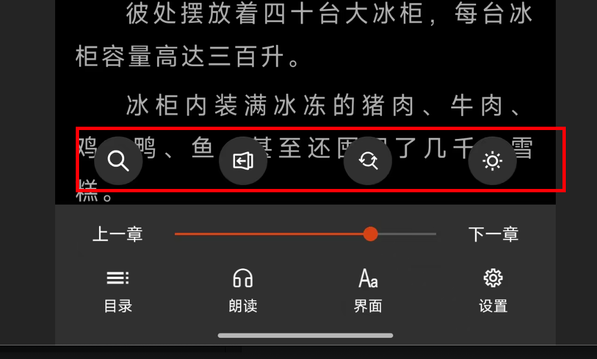

# Legado Flutter

Legado（开源阅读）的 Flutter 版本实现。

## 功能特性

- ✅ 自定义书源规则
- ✅ 网络小说阅读
- ✅ 本地文件支持（TXT、EPUB）
- ✅ RSS 订阅
- ✅ 替换净化规则
- ✅ 阅读设置自定义
- ✅ 主题切换
- ✅ 书签和阅读记录
- ✅ 朗读功能（TTS）
- ✅ Web 服务 API

## 项目结构

```
lib/
├── main.dart                 # 应用入口
├── app.dart                  # 应用主类
├── config/                   # 配置
│   ├── app_config.dart
│   └── theme_config.dart
├── data/                     # 数据层
│   ├── database/            # 数据库
│   ├── models/              # 数据模型
│   └── repositories/        # 数据仓库
├── services/                 # 服务层
│   ├── book_service.dart
│   ├── source_service.dart
│   ├── network_service.dart
│   └── rule_service.dart
├── providers/                # 状态管理
│   ├── book_provider.dart
│   └── source_provider.dart
├── ui/                       # UI 层
│   ├── pages/               # 页面
│   │   ├── bookshelf/      # 书架
│   │   ├── reader/         # 阅读器
│   │   ├── source/         # 书源管理
│   │   └── settings/       # 设置
│   ├── widgets/            # 组件
│   └── themes/             # 主题
└── utils/                    # 工具类
    ├── html_parser.dart
    ├── rule_parser.dart
    └── js_engine.dart
```

## 开发

### 基础命令

#### 安装依赖
```bash
flutter pub get
```

#### 清理构建缓存
```bash
flutter clean
flutter pub get
```

#### 检查 Flutter 环境
```bash
flutter doctor
```

### 运行项目

#### 运行到默认设备（自动选择）
```bash
flutter run
```

#### 运行到 macOS
```bash
flutter run -d macos
# 或
flutter run macos
```

#### 运行到 iOS（需要 macOS 和 Xcode）
```bash
flutter run -d ios
# 或
flutter run ios
```

#### 运行到 Android
```bash
flutter run -d android
# 或
flutter run android
```

#### 运行到 Web
```bash
flutter run -d chrome
# 或
flutter run -d web-server
```

#### 热重载
在运行应用时，按 `r` 键进行热重载，按 `R` 键进行热重启。

#### 查看可用设备
```bash
flutter devices
```

### 构建项目

#### 构建 macOS 应用（Debug）
```bash
flutter build macos
```

#### 构建 macOS 应用（Release）
```bash
flutter build macos --release
```

#### 构建 iOS 应用（需要 macOS 和 Xcode）
```bash
flutter build ios --release
```

#### 构建 Android APK
```bash
flutter build apk --release
```

#### 构建 Android App Bundle
```bash
flutter build appbundle --release
```

#### 构建 Web
```bash
flutter build web --release
```

### 代码生成

#### 生成代码（一次性）
```bash
flutter pub run build_runner build --delete-conflicting-outputs
```

#### 监听模式（自动生成）
```bash
flutter pub run build_runner watch --delete-conflicting-outputs
```

### 测试

#### 运行所有测试
```bash
flutter test
```




#### 运行测试并生成覆盖率报告
```bash
flutter test --coverage
```

### 代码检查

#### 分析代码
```bash
flutter analyze
```

#### 格式化代码
```bash
flutter format .
```

#### 格式化并检查
```bash
flutter format --set-exit-if-changed .
```

### 其他常用命令

#### 查看 Flutter 版本
```bash
flutter --version
```

#### 升级 Flutter
```bash
flutter upgrade
```

#### 查看已安装的包
```bash
flutter pub deps
```

#### 更新依赖
```bash
flutter pub upgrade
```

#### 查看项目信息
```bash
flutter pub outdated
```

### 开发工具

#### 启动 Dart DevTools
```bash
flutter pub global activate devtools
flutter pub global run devtools
```

#### 性能分析
```bash
flutter run --profile
```

#### 查看日志
```bash
flutter logs
```

## 平台支持

- ✅ Android
- ✅ iOS
- ⏳ Web (计划中)
- ⏳ Desktop (计划中)

